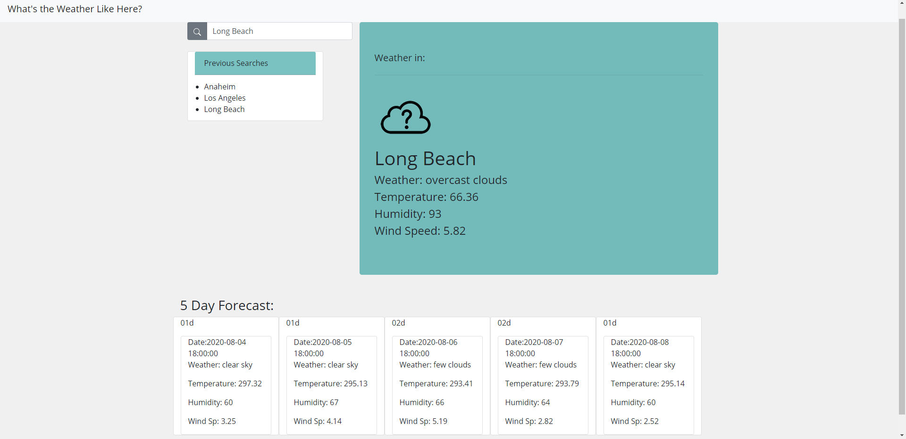

# weatherapp.github.io

## This is my weather app where you can:
### Check today's forecast 
### Check the forecast for the next 5 days
### Through these you'll find out the Weather, Temperature, Humidity and Wind Speed.

## It was made through the use of: html, css, javascript, axios, bootstrap and the [weather API:](https://openweathermap.org/api)

I have files for a set of icons included, but in the end only their codes would show up.  Hopefully I can get this fixed so that instead of the icon code the actual photo shows up. The icons I used can be found at [this github](https://github.com/yuvraaaj/openweathermap-api-icons), which I found through [this forum post.](https://stackoverflow.com/questions/44177417/how-to-display-openweathermap-weather-icon/62369654#62369654)

In the end I am proud of what I was able to accomplish, especially since I'm still trying to grasp JavaScript. 

Here's a [link]( https://marcymar.github.io/weatherapp.github.io/) to the app and a screenshot of it as well:

